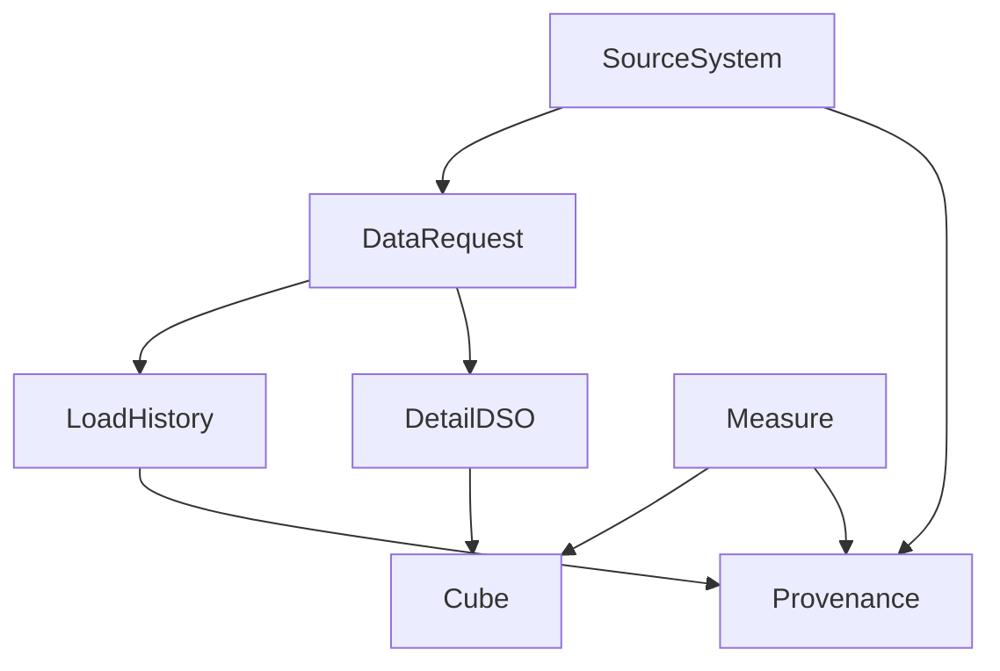

# DecisionPro Business Object Catalog

SAP naming is used for warehouse objects. Business objects below are the enterprise vocabulary bound to XenoDroid BW.

## Objects

### Measure

- **Meaning:** Named legislative/analytic indicator with definition and unit.
- **Key attributes:** MeasureID, Name, Definition, Unit, Grain, ProvisionalFlag, SuppressionPolicy, SourceSystemRefs.
- **Invariant:** Accurate display requires catalog resolution.

### SourceSystem

- **Meaning:** Publishing authority / feed identity for provenance.
- **Key attributes:** FromSysID, Publisher, TOSGrade, BaseURI, AttributionNotes, PaidFollowOnTODO.
- **Invariant:** TOSGrade gates accurate-path ingest.

### DataRequest

- **Meaning:** Executable retrieve/load specification (SAP-style request metaphor).
- **Key attributes:** DataRequestID, FromSysID, TargetPSAPath, LoadClass (`TEST`|`REAL`), ScheduleOrManual, Status.
- **Functions:** Run, Purge (for TEST), Record history.

### LoadHistory

- **Meaning:** Immutable-enough run record for trust UI.
- **Key attributes:** LoadHistoryID, DataRequestID, StartedAt, CompletedAt, SourceURI, AsOfDate, RowCounts, ContentHash, Status, LoadClass.
- **Invariant:** Every successful/failed run produces a history row.

### DetailDSO

- **Meaning:** Cleansed detail DataStore object (SAP Detail DSO metaphor) in Postgres.
- **Key attributes:** business keys per domain + FromSysID + AsOfDate + LoadClass + LoadHistoryID.
- **Invariant:** No DETAIL facts without FromSysID and AsOfDate.

### Cube

- **Meaning:** Aggregated multi-dimensional store for UI grains.
- **Key attributes:** CubeID, Dimensions, Measures, RefreshLoadHistoryID, LoadClass.
- **Invariant:** Accurate UI reads `LoadClass=REAL` cubes only after gate.

### Provenance

- **Meaning:** User-facing trust bundle for a displayed number.
- **Key attributes:** MeasureID, DefinitionSnapshot, FlowStages, LoadHistoryID, SourceAttribution, FreshnessDerived.
- **Not** a separate physical table required if assembled from catalog + LoadHistory + lineage — may be a view/API.

## Relationships

## State-bearing notes

- DataRequest: INITIAL → RUNNING → SUCCEEDED | FAILED
- LoadClass TEST must be purgeable to empty fact state
- Measure ProvisionalFlag remains true until client selection decision
