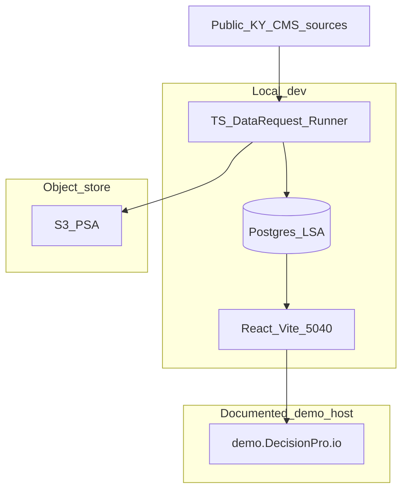

# DecisionPro Solution Architecture

## Components

| Component | Technology | Responsibility |
|-----------|------------|----------------|
| PSA landing | S3-compatible object store | Raw Data Request lands |
| LSA / Detail DSO / cubes | Postgres | Cleansed detail + aggregates |
| Data Request runner | TypeScript | Retrieve, cleanse orchestrate, load, purge, history |
| Measure / source catalog | Versioned docs → later DB tables | Definitions & TOS |
| UI | Existing React wireframe (`wireframe V1`, port **5040**) | Legislative views + provenance |
| Demo publish | Documented GitHub Pages / `demo.DecisionPro.io` | Static or built UI per existing DNS docs |

## Deployment view (POC — documented hosts only)

Do **not** invent unregistered staging/production landscapes. Cloud account details are a build-time Director choice within this shape.

## Integration contracts (logical)

- `POST /data-requests/:id/run` (or CLI equivalent) → LoadHistory
- `POST /data-requests/purge-test` → empty-check report
- `GET /measures/:id/value?grain=…` → value + provenance bundle
- `GET /provenance/:measureId` → definition, flow, history, source

Exact HTTP vs CLI for POC is an implementation detail; both must support the post-build gate.

## ADRs (draft)

| ADR | Decision |
|-----|----------|
| ADR-001 | XenoDroid BW over licensed SAP BW |
| ADR-002 | SAP naming only in warehouse layer |
| ADR-003 | Accurate path vs labeled fixture interaction path |
| ADR-004 | Post-build TEST → purge → REAL → accuracy gate is mandatory |

## Trust / failure boundaries

- Public internet retrieval failures do not corrupt REAL cubes.
- TEST and REAL are hard-separated by LoadClass.
- UI accurate mode refuses TEST facts.
- LMDSys is outside the trust boundary entirely (separate repo/product).
