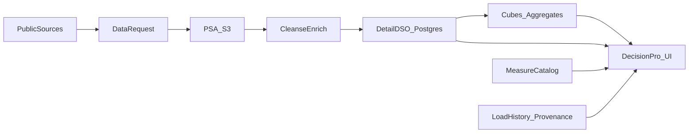
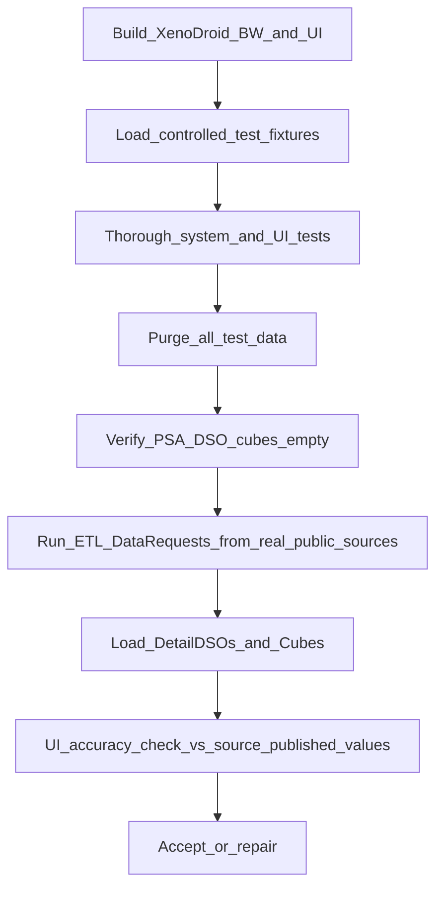

# DecisionPro POC Lifecycle Plan (repo-owned)

**Status:** draft planning artifact (relocated from Cursor plan; living copy for this repo)  
**App ID:** `decisionpro`  
**Canonical Git root:** this repository  
**Local UI:** http://localhost:5040  
**Demo host (documented):** https://demo.DecisionPro.io  
**Product:** DecisionPro Kentucky — Legislative Modeling & Decision Support System (XenoDroid Inc.)  
**Leave alone:** LMDSys legacy project — do not modify

## Locked decisions

- Accurate public-data POC/demo path with **complete synthetic analytical cutover** (REAL or labeled Gap only on Evidence Rooms / Blender / role tiles); sell paid build-out via explicit gaps (“it works; for X/Y/Z we need 1/2/3”). See [real-data-hydration-plan.md](./real-data-hydration-plan.md).
- `LoadClass=TEST` fixtures remain only for the gate harness and are purged before REAL accuracy claim.
- **XenoDroid BW:** mimic SAP BW LSA with SAP naming only — PSA → cleanse → detail DSO → cubes; Data Requests. Stack: S3 PSA + Postgres LSA + TypeScript Data Request runner + existing React wireframe. No licensed SAP BW. No dual SAP/non-SAP synonym layer. Reuse modularity is a future direction — do not overbuild.
- Provenance: measure catalog + `FromSysID` + `AsOfDate` on records; freshness derived at report/aggregate time; UI path “why trust this number?” (definition, flow, load history, source).
- Provisional 20–30 measure starter catalog; client chooses later.
- Author substantive `docs/lifecycle/round-001` phase MDs; do **not** run thin inherited Remodel auto-push as the primary path.
- Ignore ChatGPT “EndPend” framing; KY SoT researched independently (see `ky-medicaid-source-catalogue.md`).

## Related artefacts

| Artefact | Path |
|----------|------|
| KY SoT / TOS catalogue | [ky-medicaid-source-catalogue.md](./ky-medicaid-source-catalogue.md) |
| Provisional measures | [provisional-measure-catalog.md](./provisional-measure-catalog.md) |
| Round-001 lifecycle MDs | `../lifecycle/round-001/phase-*/` |
| Requirements provenance | `../../docswamp/` (transcript = source; Requirements Assessment = interpretation) |
| DNS / demo hosting | [../DNS.md](../DNS.md) |

## Architecture sketch

## Post-build verification and real-load gate (mandatory)

After XenoDroid BW + UI are built, population and acceptance follow this **strict sequence**. Test data must never remain on the accurate-demo path.

1. **Controlled test-data population** — Load labeled synthetic fixtures (`LoadClass = TEST`) through PSA → cleanse → Detail DSO → cubes. Never present as authoritative Medicaid fact.
2. **Thorough testing on test data** — Unit/integration for Data Request runner, cleanse, DSO/cube loads, measure resolution; UI journeys on port 5040 including “why trust this number?”; negative tests for restricted/out-of-POC sources.
3. **Empty / purge test data** — Remove all `LoadClass = TEST` from PSA, staging, Detail DSOs, and cubes; verify empty (or catalog-only) fact tables; record purge in LoadHistory. Do not proceed until empty-check passes.
4. **Real-source ETL and warehouse load** — Data Requests against catalogue rows graded `SAFE` or `ATTRIBUTABLE` only; land in S3 PSA with `FromSysID` + retrieval timestamp; load Detail DSOs and cubes; record LoadHistory.
5. **Interface accuracy check** — Compare displayed values to the same published source aggregates (within documented rounding/aggregation rules). Failures → repair → reload → recheck before claiming accuracy on the demo path.

**Defaults:** After cutover, interaction demos use the same REAL/Gap cubes (no synthetic magnitudes). Real-load gate applies to the full UI analytical surface. UX chrome (filters, walkthroughs, blend weights) may remain without inventing warehouse values.

## Round-001 phase primary MDs

| Phase | Primary MD |
|-------|------------|
| 100 | `phase-100/PROJECT-CHARTER.md` |
| 200 | `phase-200/GENERAL-REQUIREMENTS.md` |
| 300 | `phase-300/BUSINESS-REQUIREMENTS-AND-RULES.md` |
| 400 | `phase-400/FUNCTIONAL-REQUIREMENTS.md` |
| 500 | `phase-500/NFR-AND-TOLERANCES.md` |
| 700 | `phase-700/BUSINESS-OBJECT-CATALOG.md` |
| 825 | `phase-825/XENODROID-BW-DATA-DESIGN.md` |
| 900 | `phase-900/SOLUTION-ARCHITECTURE.md` |
| 1000 | `phase-1000/PHYSICAL-SCHEMA.md` |

## Explicit non-goals

- Any modify/rename of the LMDSys project
- PHI / member-level / authorized DMS feeds in POC
- Overbuilt multi-product XenoDroid packaging
- Dual SAP/non-SAP naming dictionaries
- Inventing unregistered deployment landscapes
- Thin Remodel auto-push of empty scaffolds as primary authoring path

## Build slice status (2026-08-01)

XenoDroid BW implemented under `xenodroid-bw/`. Full gate + public hydration cutover passed:

`npm run bw:install` → `npm run bw:up` → `npm run bw:gate`

Observed REAL accuracy (re-check on each gate run):

- M-001 KY total Medicaid & CHIP enrollment = **1,294,021** (period 202603) from CMS PI CSV
- M-002 YoY = **-6.27%**
- M-007 active MCO count = **5** (curated DMS roster; Anthem exited)
- Public hydration pack loads M-003/M-004/M-010–M-012/M-014/M-017/M-022/M-023/M-028 + 41 room rows + 7 Gap objects

UI exports: `accurateLanding.js`, `roomCubes.real.js`, `blenderFindings.real.js`, `authoritativeSources.js`, `gapObjects.js`.  
Nav: **Authoritative sources**. Footer: **Public REAL + labeled gaps**.
