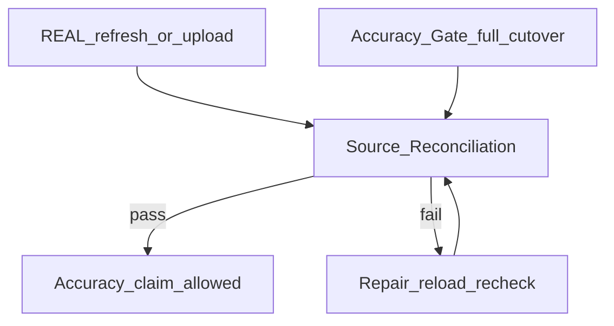

# Source Reconciliation

**Status:** locked name + repeatable operator plan  
**App ID:** `decisionpro`  
**Business Action:** *Reconcile Published Measures*  
**Rule:** accuracy claims require a passed Source Reconciliation for the measures in scope; the Accuracy Gate may invoke this process but is not this process

## Glossary (do not collapse)

| Term | Meaning |
|------|---------|
| **Accuracy Gate** | Pipeline / release control: TEST → thorough tests → purge → empty-check → REAL ETL → Source Reconciliation → UI export. Operator: `npm run bw:gate`. Owns whether the accurate path may be released after cutover. |
| **Source Reconciliation** | Independent verification that presented numbers match the **owning** published source aggregates (plus lineage and definition alignment). Runs after every REAL refresh/upload; also runs as a step inside the Accuracy Gate. Operator core: `npm run bw:accuracy`. |
| **Concordance review** | Advisory cross-check against related authoritative sources. Differences often reflect period, grain, or methodology — not automatic ETL failure. Does not replace owning-source reconcile; does not alone authorize an accuracy claim. |

## Purpose

Prove that dashboard / cube magnitudes on the `LoadClass=REAL` path are **legitimate** (attributable, lineage-intact) and **accurate** (reproduce the owning published aggregate under documented tolerances) — independently of “the pipeline ran successfully.”

## Triggers

Run Source Reconciliation whenever any of the following occurs:

1. **Post-refresh** — REAL Data Requests completed and Detail DSOs / cubes refreshed.
2. **Post-upload** — Manual or curated PSA land (PDF extract, roster update, hydration pack) loaded into DSOs/cubes.
3. **Accuracy Gate step** — Invoked automatically inside `npm run bw:gate` after REAL ETL (before UI export is treated as claim-ready).
4. **Before accuracy claim** — Before demo or marketing language asserts that a measure is accurate.

Do **not** require a full Accuracy Gate (TEST / purge) for every refresh; require Source Reconciliation for every REAL change that can affect displayed magnitudes.

## Relationship to Accuracy Gate



- Accuracy Gate **owns release control**.
- Source Reconciliation **owns legitimacy and accuracy of presented numbers**.
- Gate calls Reconciliation; Reconciliation may also run alone after a refresh without re-running TEST/purge.

## Inputs

| Input | Source |
|-------|--------|
| Measure scope | [`provisional-measure-catalog.md`](./provisional-measure-catalog.md) — MeasureID, grain, Source catalogue ID(s), FromSysID |
| Owning source | [`ky-medicaid-source-catalogue.md`](./ky-medicaid-source-catalogue.md) — URI, TOS grade, attribution, limitations |
| Load record | LoadHistory (`DataRequestID`, `SourceURI`, `AsOfDate`, `ContentHash`, `LoadClass`, row counts) |
| Warehouse facts | PSA path for the load → Detail DSO → cube measure values |
| UI surface | Accurate-path exports (e.g. `accurateLanding.js`, room/blender REAL bundles) or live UI on port `5040` |
| Tolerances | [`../lifecycle/round-001/phase-500/NFR-AND-TOLERANCES.md`](../lifecycle/round-001/phase-500/NFR-AND-TOLERANCES.md) |

Only `SAFE` / `ATTRIBUTABLE` sources on the accurate path. Gap objects are verified as **gaps** (no invented magnitude), not reconciled as published facts.

## Repeatable steps

Execute in order for each MeasureID in scope (or the full gate measure set).

### 1. Lineage walk

Confirm a continuous chain:

`UI / export value → cube → Detail DSO → PSA extract → LoadHistory → SourceURI + AsOfDate (+ ContentHash when available)`

Fail if any hop is missing, `LoadClass` is not `REAL` on the accurate path, or provenance cannot identify the owning publish period.

### 2. Owning-source reconcile (pass/fail)

Re-open or re-fetch the **same** published artifact cited in LoadHistory (dataset file, CMS PI CSV, DMS page, PDF section). Compare cube/UI aggregate to that published value.

- Exact match when grain matches.
- Otherwise documented rounding ≤ display precision, shown in provenance.
- PDF / manual transcription OK in POC if LoadHistory cites report title, FY/period, section, retrieval date.

Primary automation: `npm run bw:accuracy` (compare cubes to sources). Supplement with UI spot-check of landing / Evidence Room values for measures in the export surface.

### 3. Definition / grain / period check

Confirm numerator, denominator, population, geography, and period match the measure catalog and the owning source. If the UI shows a derived or proxy measure (e.g. YoY %, AHRQ proxy), verify the **formula and labels**, not an invented “same number” from an unrelated feed.

Misaligned definition → fail reconcile **or** reclassify display as Gap / benchmark / proxy (never silent average of conflicting sources).

### 4. Concordance review (advisory)

Where a second authoritative source answers a comparable question, record expected band, known lag, and method differences. Investigate outliers; do **not** treat cross-source delta as the accuracy gate criterion.

### 5. Record outcome

For each MeasureID: `PASS` | `FAIL` | `GAP` | `ADVISORY` (concordance only), expected, actual, detail, LoadHistoryID / SourceURI / AsOfDate. Failures → repair → reload → re-run Source Reconciliation before claiming accuracy.

## Pass criteria

Aligned with NFR tolerances (`DP-REQ-N-005` and Numeric match row):

| Result | Criterion |
|--------|-----------|
| **PASS** | Lineage intact; `LoadClass=REAL`; value matches owning published aggregate (or documented rounding); period/grain labeled |
| **FAIL** | Mismatch beyond tolerance, broken lineage, TEST leakage, or missing provenance |
| **GAP** | Accurate path correctly shows Gap object / unavailable — no false magnitude |
| **Claim allowed** | All in-scope Accurate-path measures are PASS or intentional GAP; no FAIL remains |

Demo may state accuracy claims **only** for measures that passed Source Reconciliation.

## UI surface (Authoritative sources)

On the legislative UI **Authoritative sources** view:

1. Tab **Source List** — catalogue, Data Spectrum, gaps (existing trust browser).
2. Tab **Source Reconciliation** — process description, process-flow diagram, last-run executive summary (aggregated check counts + headline numbers), per-check results, verify links (FromSysID → Source List, source page/file URIs), and **Download Excel** workbook.

Export payload: `wireframe V1/app/src/data/alp/sourceReconciliation.js` (written by `npm run bw:accuracy` and `bw:export` / Accuracy Gate).

## Operator commands

```powershell
# After REAL refresh/upload (standalone Source Reconciliation core + UI last-run export)
npm run bw:accuracy

# Full cutover (Accuracy Gate — includes Source Reconciliation)
npm run bw:gate
```

Supporting checks:

| Action | How |
|--------|-----|
| REAL ETL only | `npm --prefix xenodroid-bw run bw:real-etl` then `npm run bw:accuracy` |
| UI export after pass | `npm --prefix xenodroid-bw run bw:export` |
| Lineage workbook (UI) | Export from legislative UI lineage tooling (`exportLineageWorkbook`) for audit packet |
| Source Reconciliation workbook (UI) | Authoritative sources → Source Reconciliation → Download Excel |
| Spot-check UI | `npm run dev` → localhost:5040 → Authoritative sources → Source Reconciliation |

## Checklist template (per refresh)

Copy per run; retain with LoadHistory references.

```
Source Reconciliation run
Date / operator:
Trigger: [ ] post-refresh  [ ] post-upload  [ ] Accuracy Gate step  [ ] pre-claim
LoadHistory IDs / ContentHashes:

MeasureID | Lineage | Owning reconcile | Definition | Concordance (advisory) | Result
---------|---------|------------------|------------|-------------------------|-------
M-001    |         |                  |            |                         |
M-002    |         |                  |            |                         |
...

Overall: [ ] PASS (claim allowed)  [ ] FAIL (repair required)
Notes:
```

## Observed REAL baseline (re-check each run)

Canonical observed values are re-validated on each gate / reconciliation run; see [`decisionpro-poc-lifecycle.md`](./decisionpro-poc-lifecycle.md) Build slice status. Examples historically observed:

- M-001 KY total Medicaid & CHIP enrollment = **1,294,021** (period 202603) from CMS PI CSV  
- M-002 YoY = **-6.27%**  
- M-007 active MCO count = **5** (curated DMS roster)

If the owning source publishes a new period, expected values update with the new LoadHistory — do not freeze stale expectations after a legitimate refresh.

## Explicit non-goals

- Renaming or replacing the Accuracy Gate / `bw:gate`
- Treating concordance deltas as pass/fail accuracy
- Inventing magnitudes when sources conflict
- PHI or authorized MMIS/claim-grain verification on the POC public path
